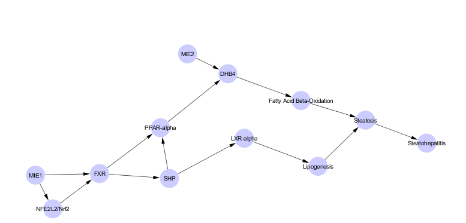

This vignette describes how to use the _aop_ package. The _aop_ package is a Bioconductor package that is intended to facilitate the analysis of adverse outcome pathways (AOPs). With this first release, the _aop_ package contains code that will allow users to use graph theory to identify those nodes in an AOP that must be measured to make a causal statement. Future releases will include code that will make it easier to use graph theory to computationally predict AOPs.

## Background

In toxicology an adverse outcome pathway (AOP) is generally defined as the collection of key events that lead to an adverse outcome. An AOP is "started" with a molecular initiating event (MIE) -- a key event where a stressor initiates the AOP. AOPs end at an adverse outcome of some sort. In an ecological context, this adverse outcome is likely to be some population level impact, such as an overall decrease in population fecundity, or a population decline. In a human health context, this AO is likely to be some adverse endpoint, such as a disease (e.g., diabetes mellitus type 2), a disease precursor (e.g., non-alcoholic fatty liver disease), or something similar, such as a deficit in executive function.

## Example: Finding Causal Nodes in an AOP

In this example, we will identify which nodes are sufficient to be measured to state that an adverse outcome is likely, or not, to occur following activation of the AOP. Sufficient in this context means that activation/deactivation of specific nodes is all the information you need to have to know that an adverse outcome will occur. This is based on Pearl's graph theory applications for causal analysis (see: Pearl's _Causality: Models, Reasoning, and Inference_). 

NOTE: for the backdoor analysis, the only information required is the network, that is, the nodes and edges. 

Here is a picture of the AOP we'll be analyzing:



The following code block shows how to input an AOP file that has been exported from Cytoscape as a Cytoscape JSON file.

```{r eval=FALSE}
library(aop)
steatosis_aop <- convert_cytoscape_to_aop("path_to_file\\aop.cyjs")
```

This code reads in the file and converts it to an *aop_cytoscape* object called *steatosis_aop*. We will use the *steatosis_aop* in our analyses.

However, as you're unlikely to have an AOP file just laying around, I've included one in Cytoscape JSON format with the package. To load this file up, you can run the code in the next block. This code finds the full file name of the _steatosis_aop_json.cyjs_ file in the aop package. The next line passes the full file name to the *convert_cytoscape_to_aop* function. 

```{r}
library(aop)
library(graph)
steatosis_json_file <- system.file("extdata", "steatosis_aop_json.cyjs", package = "aop")
steatosis_aop <- convert_cytoscape_to_aop(steatosis_json_file)
```

Now that we have an *aop_cytoscape* object, we can analyse it to find the sufficient/causal nodes. To do this, we need to convert the *aop_cytoscape* object to a graph, and then perform a "backdoor"" analysis using graph theory. The next code block will first show a picture of the graph (for comparison purposes)

```{r}
steatosis_graph <- convert_aop_to_graph(steatosis_aop)
plot(steatosis_graph)
```

As you can see, the graphs are largely similar. The challenge with the R-based graph picture is that the nodes aren't labeled in a very meaningful way, but it's easy to see what the nodes map to. For instance, if you want to see what node 387 maps to, you would do:

```{r}
getAOPNodeName(steatosis_aop, "387")
```

The backdoor analysis is based on the idea that there is an adverse outcome and you want to know what nodes are causal for it. In other words, which nodes do you need to measure in order to be able to say anything with confidence about the likelihood of the adverse outcome occuring. Thus, you need to tell the algorithm where the molecular initiating event of interest is. In this case, node 390 is the MIE, and 388 is our adverse outcome of interest (388 is steatosis). So the backdoor analysis is performed by running:

```{r}
aop_backdoor(steatosis_graph, "390", "388")
```

Thus, you can see that nodes 389 and 392 both have to be measured. Those nodes correspond to:

```{r}
getAOPNodeName(steatosis_aop, "389")
getAOPNodeName(steatosis_aop, "392")
```


